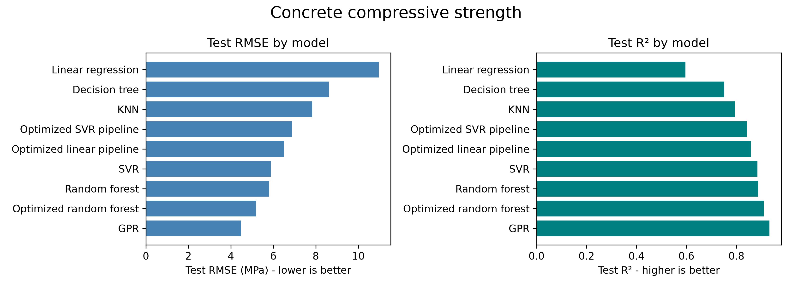

# Concrete Strength Analysis and Prediction

This project predicts concrete compressive strength using Gaussian Process Regression (GPR), provides an interactive Streamlit web app for exploring mix designs over curing age, and documents a model-evaluation experiment in notebooks.

## Quick Start

1. Open the repository in VS Code and reopen it in one of the provided devcontainers.
2. Wait for the container to finish installing dependencies from `requirements.txt`.
3. Start the app from the repository root:

```bash
streamlit run app/app.py
```

## Interactive Web App

The app in `app/app.py` allows users to tune cement mixture components with sliders and view the predicted strength curve over age.

### App Functionality

- Loads a trained GPR model from `models/gpr_models.pkl` or `models/gpr_model.pkl`.
- Users specify a concrete mixture with sliders for each component.
- Predicts strength over the full age range in the dataset.
- Shows mean prediction with a 95% confidence interval.
- Uses an interactive Plotly chart so users can mouse over to inspect values
- Highlights a user-selected day and shows the prediction and CI as a metric.

### Run the App

From the repository root:

```bash
streamlit run app/app.py
```

## Model training & evaluation

The model training and evaluation workflow is documented in `notebooks/01-model-evaluation.ipynb`. To select the model for use in the app, seven model types were tested and compared:

1. **Linear regression**
2. **K-nearest neighbors (KNN) regression**
3. **Decision tree regression**
4. **Random forest regression**
5. **Optimized random forest regression**
6. **Support vector regression (SVR)**
7. **Gaussian process regression (GPR)**



The gaussian process regression model significantly out-performed the other candidates. It also has the added benifit of predicting a mean and standard deviation for concrete strength, rather than a single point estimate. The final model produced by the notebook is a Scikit-learn `Pipeline()` object which bundles the data preprocessing and GPR regression into a single estimator.

## Development setup

This repository is configured for development in a devcontainer and does not require a separate Python virtual environment.

### Supported platforms

- CPU: `.devcontainer/cpu/devcontainer.json`
- Mac (Apple Silicon): `.devcontainer/mac/devcontainer.json`
- NVIDIA GPU: `.devcontainer/nvidia/devcontainer.json`

Each configuration uses `postCreateCommand` to install dependencies from `requirements.txt`.

### Requirements

- VS Code
- Docker Desktop or Docker Engine

### Instructions

1. Fork and clone the repository. 
2. Open the repository clone directory in VS Code using the `Dev Containers: Open Folder in Container` commant
3. Wait for container setup to finish (`pip install -r requirements.txt` is run automatically).
4. Start the app with:

```bash
streamlit run app/app.py
```

## Dependencies

Project dependencies are listed in `requirements.txt`, including:

- streamlit
- plotly
- scikit-learn
- pandas
- numpy
- joblib

Dependencies are automatically installed in the devcontainer during creation.